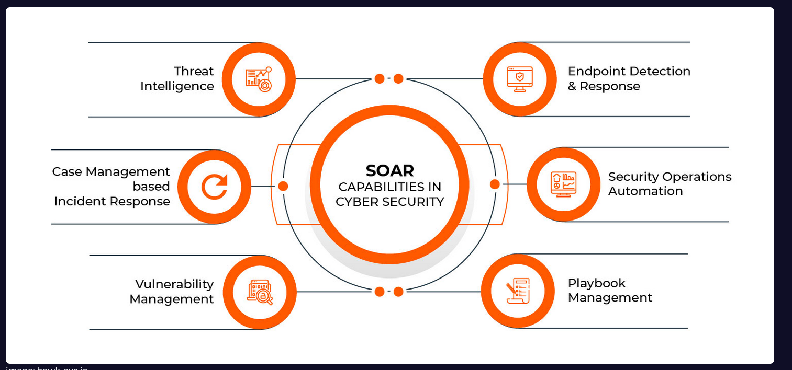

# SOC ANALYST AND THERI RESPONSIBLIETS 

A SOC ANALYST is the first person to investiag3e threats to a system. If the situation demands it, they take this to their superviosrs so they can mitigate the threats. **THEY ARE FIRST PERSON TO REPONSE TO A THEREAT.** 

Through out the day , a soc analyst typically review alerts in teh SIEM and determines which is a real threat. For this they use several tools one is **EDR** ( Endpoint Detection and REsponse), **LOG** management, And **SOAR**.  

# SIEM and Analyst Relationship

## What is SIEM

**SIEM** is a secuirty solution that combines security informatoin and event management, which involves real-time logging of events in an environment. The ulitmate purpose of event logging is to detect securiyt threats. 

Some popular SIEM solutions: IBM QRadar, ArcSight ESM, FortiSIEM, Splunk, etc. 

## Relationship

Although SIEM solutions have many features, SOC analysts typically  only track alerts. There are other groups/people responsible for  developing configurations and rule correlations.

As mentioned above, alerts are generated from data that passes  through filters. Alerts are first analyzed by a SOC analyst. This is  where a SOC analyst's job in the security operations center begins. In  essence, they have to determine whether the generated alert is a real  threat or a false alert.

# Log Management 

it provides access to all logs in an environment ( web logs, os logs, firewall, EDR etc) and allows you to manage them in one place. 

SOC analysts typically rely on Log Management to determine if there is  any communication with a particular address and to view the details of  that communication. Let's say you came across a piece of malware and  after running it, you found that it was communicating with and executing commands from the "letsdefend.io" address. In this situation, the  command&control center is "letsdefend.io", you can search for  "letsdefend.io" in your company's log management to see if any devices  have attempted to communicate with the command&control center.

This leaves us with a second situation: You see a SIEM alert indicating  that a LetsDefendHost device on your network is leaking data to IP  address 122[.]194[.]229[.]59. You have conducted an investigation,  isolated the device from the network, performed the necessary processes, and now you are in control. But there's still something you haven't  addressed: are there any other devices sending data to the suspicious IP address (122[.]194[.]229[.]59)? The alert may have only included  LetsDefendHost, but you should still search for the suspicious address  in Log Management to see if there is anything the system may not have  detected and try to find any connections.

# EDR - EndPoint Detection And Response

**EDR** is also know as endpoint threat detection and response ETDR, is an integrated endopint security solution that combines continous, real-time montioring and colection of endpoint data with rules-based automated response and analysis. 

Some EDR solutions commonly used in the workplace: CarbonBlack, SentinelOne, and FireEye HX.

we can do live investiageiton by connecting to the machines 

we can also perform containment. 

# SOAR ( Security Orchestration Automation and Response) 

it enables security products and tools in an evn to work together, streamlining the tasks of soc team memebrs. For example, it will automatically search VirusTotal for the source IP  of a SIEM alert, reducing the workload of the SOC analyst.

Some SOAR products commonly used in the industry:

- Splunk Phantom
- IBM Resilient
- Logsign
- Demisto

  THese all can be done using SOAR 

SOAR save time wiht workfolws that automate processes. ome common workflows are:

- IP address reputation control
- Hash query
- Scanning an acquired file in a sandbox environment
- …

## PLAYBOOKs

you can easily investiage SIEM alerts using playbooks created for different secnarious wihtin SOAR. Even if you don't know or remeber all the procedures, you can perform an analysis by following the steps outlined in the playbook.

## THreat intelligence 

A Threat Intelligence Feed is data (such as malware hashes, C2  (Command&Control) domain/IP addresses etc.) provided by a third  party company.

Here are some free and popular sources you can use:

- ​    [       VirusTotal     ](https://www.virustotal.com/)  
- ​    [       Talos Intelligenc](https://talosintelligence.com/)