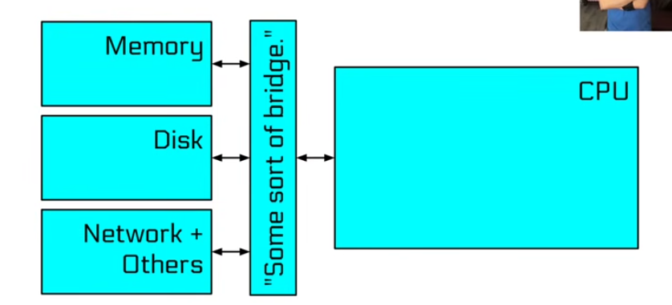
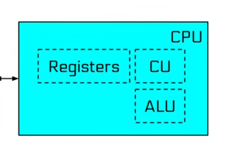
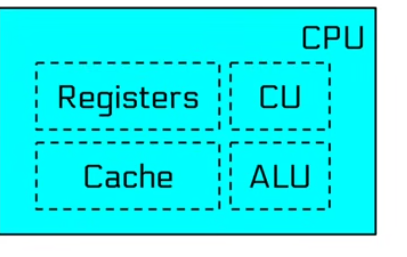
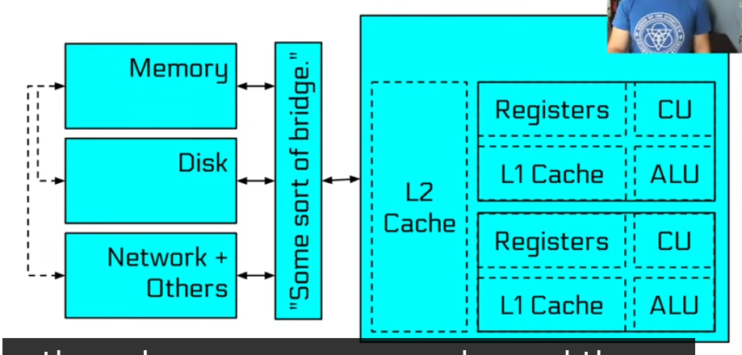

Computer Architecure

every code you right it's basically leads to cpu. and it's get executed in binary-encoded instructions. 

a modern computer might look something like this 

and inside cpu we have different componnets like Registers, control unit, arthemetic logical unit 

and there is one more thing called caching 

our cpu has mulitple cores so we have this : 

