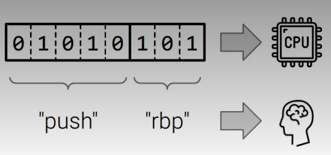

## Assembly

Reading Binary for human is hard so we have created a text reprensentation of binary.. this representation is called as `**Assembly**` binary and assembly code is equivalent

Assembly is named "assembly" because it is assembled ( not complied ) into binary code.

##### Assembly tells the CPU what to do 

we have instructions in assembly to convey something 
what do you want the instruction to do? we will call this an "operation" 
what do you want the instruction to do it to ? we will call this an "operand"

here hte main part is data, we deal with data all the time and cpu handles data in three different ways : 

1. data we direct give it as part of instruction ( data that we directly provide to cpu)
2. data that is close at hand ( cpu recivecs data from you and put's it in it's register )
3. data in storage

###### Operations

we might do all these wiht the data : 

- add some data togeter
- subtract some data
- mulitply some data
- divide some data
- move some data inot or out of storage 
- compare two pices of data with each other 
- test some other properties of data 

#### Assembly Dialects 

Assembly is a direct translation of binary code ingest by the cpu.. so its very cpu architecure dependent. Every architecture has it's own variant:

- x86 assembly
- arm assembly
- ppc assembly
- mips assembly
- risc-v assembly
- pdp-11 assembly

#### Dialects of Assembly dialects 

in the beginning (of x86), intel created : 

there are many in the list we use INtel x86 syntax not the AT&T one 