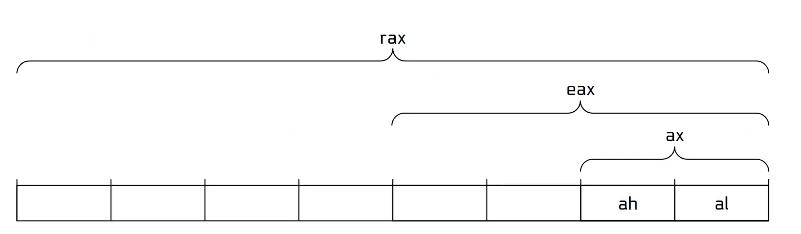

## Registers

THe need for register :
cpu need to be fast , to be fast , cpu's need rapid access to data they are working on. THis is done via the Register File. THe register sits right inside the cpu as we seen in the computer architecure lecture. 


Registers are very fast, temporary stores for data. it's the typical place to store data for cpu. Several General purpose registers: 

- 8085: a, c, d, b, e, h, l
- 8086: ax, cx, dx, bx, sp, bp, si, di
- x86: eax, ecx, edx, ebx, esp, ebp, esi, edi
- amd64: rax, rcx, rdx, rbx, rsp, rbx, rsi, rdi, r8, r9, r10, r11, r12, r13, r14, r15
- arm: r0, r1, r2, r3, r4, r5, r6, r7, r8, r9 ,r10, r11, r12, r13, r14 

the address of the next instruction is in a register: 

eip (x86), rip (amd64), r15(arm)

#### Register size 

on a 64-bit architecutre ( most ) registers will hold 64bits ( 8bytes )

we can aceess registers by their name or we coould do partial register access 

#### Partial Register access



registers can be access partially. here 
rax is 64 bit x86 arch and in the old intel old 8085 we have 8 bit arch so we use a register called a and after some evoluiton it become ah and al 2 bit, after this we got 16bit register ax and then we got exteended register eax of 32 bit 

| 64-bit | 32-bit | 16-bit | 8-bit High | 8-bit Low |
| ------ | ------ | ------ | ---------- | --------- |
| rax    | eax    | ax     | ah         | al        |
| rcx    | ecx    | cx     | ch         | cl        |
| rdx    | edx    | dx     | dh         | dl        |
| rbx    | ebx    | bx     | bh         | bl        |
| rsp    | esp    | sp     |            | spl       |
| rbp    | ebp    | bp     |            | bpl       |
| rsi    | esi    | si     |            | sil       |
| rdi    | edi    | di     |            | dil       |
| r8     | r8d    | r8w    |            | r8b       |
| r9     | r9d    | r9w    |            | r9b       |
| r10    | r10d   | r10w   |            | r10b      |
| r11    | r11d   | r11w   |            | r11b      |
| r12    | r12d   | r12w   |            | r12b      |
| r13    | r13d   | r13w   |            | r13b      |
| r14    | r14d   | r14w   |            | r14b      |
| r15    | r15d   | r15w   |            | r15b      |

we know register hold but how do we put data in them so we use an assembly instruction called **mov** means move 

you load data into registers with **mov**

```assembly
mov rax, 0x539
mov rbx, 1337	
```

we can addd data into partial register 

```assembly
mov ah, 0x5
mov al, 0x39
```

if you write to a 32-bit parttial ( eg: eax ), the cpu will zero out the rest of the register. this was done for perfromance reasons. 

Before:

RAX = 1234567890ABCDEF
       └──────┬──────┘
       upper   lower
       32      32


mov eax, 11223344

After:

RAX = 0000000011223344
       └──────┬──────┘
       00000000 11223344

mov doesn't move the data, it copies it

we could also do this : 

```
mov rax, 0x539
mov rbx, rax
```

here both rax and rbx have same value of 0x539(1337)

```
mov rax, 0x539
mov rbx, 0
mov bl, al 
```

this sets rax to  rax to 1337 and rbx to 0x39

for suppose conside : 

mov eax, -1 

eax is now 0xfffffff ( both 4294967265 and -1 ) but... 

rax is now 0x00000000ffffffff( only 4294967295)

what if you wanted to operation on that -1 in 64-bit land ? 

```assembly
mov eax, -1
movsx rax, eax
```

eax is now 0xffffffff

rax is now 0xffffffffffffffff

so here **movsx** means move with sign extension 

### Register arithemetic 

we can do many aithemetic operations on register : 	

```assembly
add rax, rbx
sub ebx, ecx
imul rsi, rdi
inc rdx
dec rdx
neg rax
not rax
and rax, rbx
or rax, rbx
xor rcx, rdx
shl rax, 10
shr rax, 10
sar rax, 10
ror rax, 10
rol rax, 10 
```

| Instruction     | C / Math equivalent                | Description                                                  |
| --------------- | ---------------------------------- | ------------------------------------------------------------ |
| `add rax, rbx`  | `rax = rax + rbx`                  | add rax to rbx                                               |
| `sub ebx, ecx`  | `ebx = ebx - ecx`                  | subtract ecx from ebx                                        |
| `imul rsi, rdi` | `rsi = rsi * rdi`                  | multiply rsi to rdi, truncate to 64 bits                     |
| `inc rdx`       | `rdx = rdx + 1`                    | increment rdx                                                |
| `dec rdx`       | `rdx = rdx - 1`                    | decrement rdx                                                |
| `neg rax`       | `rax = 0 - rax`                    | negate rax in terms of numerical value                       |
| `not rax`       | `rax = ~rax`                       | negate each bit of rax                                       |
| `and rax, rbx`  | `rax = rax & rbx`                  | bitwise AND between the bits of rax and rbx                  |
| `or rax, rbx`   | `rax = rax \| rbx`                 | bitwise OR between the bits of rax and rbx                   |
| `xor rcx, rdx`  | `rcx = rcx ^ rdx`                  | bitwise XOR (don't confuse ^ for exponent!)                  |
| `shl rax, 10`   | `rax = rax << 10`                  | shift rax's bits left by 10, filling with 10 zeroes on the right |
| `shr rax, 10`   | `rax = rax >> 10`                  | shift rax's bits right by 10, filling with 10 zeroes on the left |
| `sar rax, 10`   | `rax = rax >> 10`                  | shift rax's bits right by 10, with sign-extension to fill the now "missing" bits |
| `ror rax, 10`   | `rax = (rax >> 10) \| (rax << 54)` | rotate the bits of rax right by 10                           |
| `rol rax, 10`   | `rax = (rax << 10) \| (rax >> 54)` | rotate the bits of rax left by 10                            |

#### special registers 

you cannot directly read from or wirte to **rip** this register contain the memeory address of the next instruction to be executed ( ip - instruction pointer)

you should be carefull with rsp conatains the address of an region of memory to store temporary data ( sp - stack pointer) 

##### rax

rax is an single x86 register, is a container for a small amount of data. 

```assembly
mov rax, 1337
```

we can move data into rax by using **mov** instruction. so here we have stored 1337 value in rax

correct intel syntax : 

```
.intel_syntax noprefix

_start:
mov rax, 60
```

### SYscall

- the programs interact wiht the os using the syscall or system call instrcution. THere are a lot of different system calls your programs can invoke. 

- a syscall is a way for a program to ask the linux kernel to perform an operation 

  ```
  exit -> terminates program
  read -> read data
  write -> write data
  open -> open a file 
  ```

- every syscall has a number 

each system call is indicated by syscall number, couting from 0 

for example here : 

```assembly
mov rax, 60 
```

here the program invokes a specific syscall by moving its syscall number into rax register and invoking the syscall instructions, 

- `rax` conatains the syscall number 

Some syscalls can have arguments like 

```c
exit(42);
```

so here

```
exit -> syscall
42 -> argument
```

so the kernel needs to know about both which syscall? and what argument ?

#### the arguments are passed through registers

linux uses specific registers to pass syscall arguments.

For x86-64 linux : 

| Purpose        | Register |
| -------------- | -------- |
| Syscall number | `RAX`    |
| 1st argument   | `RDI`    |
| 2nd argument   | `RSI`    |
| 3rd argument   | `RDX`    |
| 4th argument   | `R10`    |
| 5th argument   | `R8`     |
| 6th argument   | `R9`     |

so the assembly code becomes thsi : 

```assembly
mov rax, 60
mov rdi, 42
syscall
```

so wee need to exit after writing the program so we need to invoke the syscall to cleanly exit 

```
.intel_syntax noprefix

_start: 
mov rax, 60
syscall
```

so this exit system call number is 60 

#### Building executables 

to build an executable binary, you need to :

1. wriet you assembly in a file ( .s )

   ```
   program.s 
   ```

2. assemble your assembly file into an object file 

   ```
   as -o program.o program.s
   ```

3. convert these object files into executables 

   ```
   ld -o program program.o
   ```

4. running these ; 

   ```
   ./program
   ```

   

```
.intel_syntax noprefix
.global _start
_start: 
	mov rax, 60
	mov rdi, 42
	syscall
```

