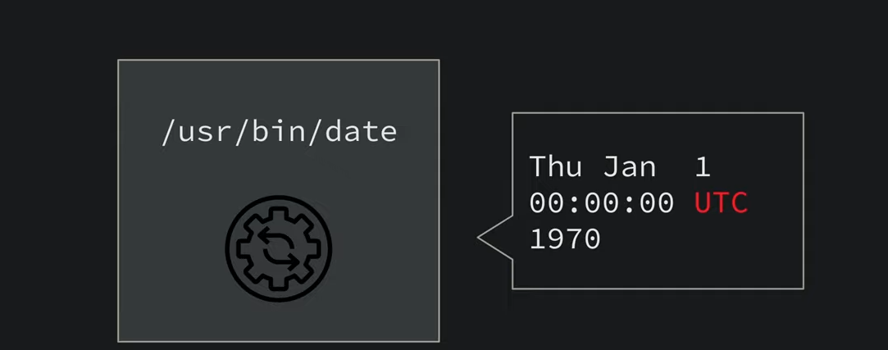
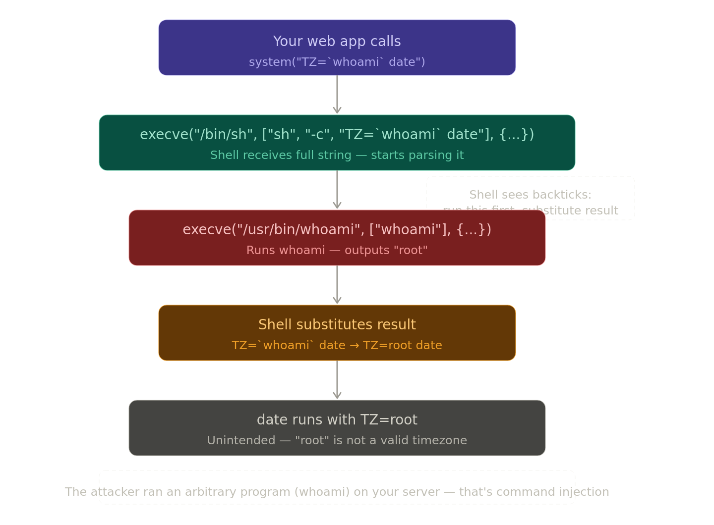
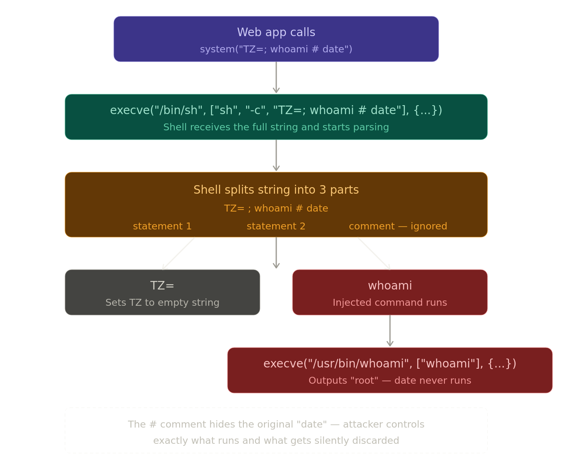

##  WEB SECurity INjection

whenever we run a command date for suppose lets use c programming to do it 

```c
system("date")
//this is a c libarary function provided by C.
    it means "Run the command datde as if i typed into a terminal "
```

when executed, it prints somethign like : 

```
Mon Jun 1 19:45:30 IST 2026
```

The important thing here is system() does not directly run /usr/bin/date. Instead it launches the shell first : 

system() actualy calls the execve system call to launch /bin/sh (the shell)

```sh
execve("/bin/sh", ["sh", "-c", "date"], envp )
```

- "/bin/sh" = the path tot he shell program to run 
- ["sh", "-c", "date"] = sh is te program name , -c tells the shell "execute the next argument as a command " and "date" is that command. basically the whole thing mean run a shell and execute the command "date".
- envp = environment variables 

After shell receives -c "date", it parses the string, find the date binary by seracing throught the PATH environment variable, and makes a second execve call to acutally run it. 

```sh
execve("/usr/bin/date", ["date"], envp)
```

- what execve() does : 

  -  execve() is linux system call that : 

    1. loads a new executable into memroy
    2. replaces the current process image.
    3. starts executing the new program.

    Prototype : 

    ```bash
    execve(path, argv, envp);
    path = execuatable path
    argv  = command-line arguments
    envp = environment variables 
    ```

A littel more complex version of above thing :

if you want to specify the timezone for date  

```bash
system("TZ=UTC date")
execve("/bin/sh", ["sh", "-c", "TZ=UTC date"], evnp)
execve("/usr/bin/date", ["date"], {"TZ": "UTC"})
```



## COmmand Injection 

lets see a case where it is command substitution 

```sh
system("TZ = `whomai` date")
```

 This is what your C code calls. The string begin passed looks normal - you're just trying to set a timezone and run `date`. but the backticks ``whoami` `   are the problem.

```sh
execve("/bin/sh", ["sh", "-c", "TZ=`whoami` date"], envp)
```

now the the shell parser take over and this is where it get dangerous. The shell has a specail rule : **Anything inside backticks get executed first** andits output is substitued in place of backtick expression. So the shell see whoami and thinks i need to run whoami, captures output and paste it 

```sh
execve("/usr/bin/whoami", ["whoami"], envp)
```

the shell calls whoami, which prints the curent user 

```shell
execve("/usr/bin/date", ["date"], {"TZ": "root"})
```

The shell then tries to run `date` with a timezone of `root`, which is nonsensical — but the real damage is already done: **an attacker got the server to run `whoami` on their behalf.**



the semicolon injecttion variant : 

```sh
system("TZ=; whoami # date")
```

- here ; ends the first shell statement, begins a new on. 
- `#` comments out everything after it (date gets ignored)

```shell
execve("/bin/sh", ["sh", "-c", "TZ=; whoami # date"])
   │
   ├─► Statement 1: TZ=        → no program runs, just sets empty env var
   │
   ├─► Statement 2: whoami     → execve("/usr/bin/whoami", ["whoami"])
   │                              OUTPUT: root  ← attacker now knows serveruser
   │
   └─► # date                  → IGNORED (comment)
```

