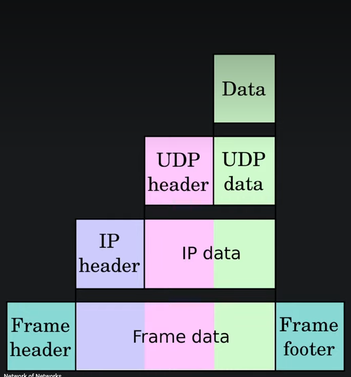

# internet

basic idea of internet is inorder to communicate with some remote system like we want to send "hello,world!!" to  some system we need a way of transmitting of that message, we need these two computers to connect we send this over a network remotely
I don't have a direct connection  

INTERNET : distributed system of computers.  it works like networks of networks. if you are connected to a different system1 that system1 is connected 2 other different system's like this all these sytems are some way connected . so we can find a path of connection between source and destination. 

ABSTRACTION: INTERNT ITSELF HAS SEVERAL LAYERS OF ABSTRACTION

TCP/IP lets see abstraction in this 

the first layer physcial link layer ;  there is some physcial link between my computer and other computer 

Internt layer ; finding the right computer IP, icmp, arp 

transport layer: find the right porgram udp, tcp it does by using a concept of ports 

application layer : talk with the program HTTP, smtp , ftp, ssh