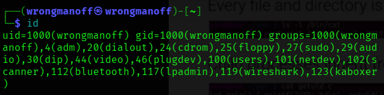
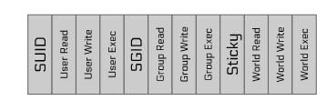

## Linux Permission model :

LInux file permission ire split into 3 categories : 

1. Owner/User = the person who owns the file

2. Group = users in teh same group

3. Other = everyone else

   Lets break down this : 

   ```
   -rwr-xr-x
   THis is a 10-character permission string.
   ```

   Format : 

   ```
   [type][owner][group][others]
   ```

   ```
   - rwx r-x r-x
   │ │   │   │
   │ │   │   └── Others permissions
   │ │   └────── Group permissions
   │ └────────── Owner permissions
   └──────────── File type
   ```

   Different kinds of file type : 

   | Symbol | Meaning          |
   | ------ | ---------------- |
   | `-`    | Regular file     |
   | `d`    | Directory        |
   | `l`    | Symbolic link    |
   | `c`    | Character device |
   | `b`    | Block device     |

Owner permission : 

```
rwx 
```

- r = read the file
- w = modify the file
- x = execute the file 

Group permission 

```
r-x
```

- group users can read file
- gropu users can execute the file
- group users cannot write the file / modify the file

Others permission : 

```
r-x
```

Everyone else can : 

- read 
- execute 
- but cannot write / modify

NUmeric representation 

```
| Permission | Value |
| ---------- | ----- |
| `r`        | 4     |
| `w`        | 2     |
| `x`        | 1     |
```

so: 

```
rwx = 4 + 2 + 1 = 7
r-x = 4+0+1 = 5
r-x = 5
-rwxr-xr-x is equals to 755
```

Every file and direcotry is owned by a user and group 

Every Process has a user ID and group ID :

- linux user the uid and gid to check permission, determine ownership, track porcesses, enfore security.



Child Processes inherit from the parent processes as we have learnt in the oops conecepts 

## uid's

UID 0 is the linux administrator user, root. Root need only for : 

- installing software. 
- loading device drivers. 
- shutting down, rebooting
- changing system-wide settings. 

# Privilege Elevation

The only way to elevate your privileges is to run an suid binary.

- setuid: execute with the euid(effective user id ) of the file owner rather than the parent process
- setgid: execute wiht the egid of the file woner rather than the parent process. 
- sticky: used for shared directories to limit file removal to file owners 

every process has three's types of id's : 

1. effective user id / gid   : whose permissions is this process currently using?. used for most access control checks. when you open a file it's check for uid's 

2. real uid / gid : who started the process , owner of the process , the true identity of the process. used for things such as singal checks. 

   A process can temporarily: 

   - gain privileges
   - drop privileges
   - regain privileges later

   Linux keeps a saved copy of the privilege identiy so that program can switch back safely. 

3. saved :  above explained 

   ### Why Save It?

   Sometimes the program:

   - needs root only briefly
   - should run most code as normal user for security

   So it can:

   1. start as root
   2. drop privileges temporarily
   3. regain root later if needed

common examples of SUID binaries: sudo, su , newgrp  



can add permission like this  :

```
sudo chmod u+s getgid 
here u means user and s mean setuid 
```

eUID 0 is powerfull. Root can : 

- open any file inluding things in the special /proc filesystem,  any device-backed files
- execute any program
- assume any other uid or gid
- debug any program

# Privilege Escalation 

Privilege Escalation is a class of exploit in which the attacker elevates their privileges to root level.

Typical flow : 

- Gain a foothold on the system(vuln network service, intended shell access, code in app context, etc)
- identify a vulnerable privileged service/process.
- exploit the privileged service to gain it's privileges. 

example : if an suid binary has a secuiryt problem, an attacker can use it in a privilege escalation attack

## major security breaches

1. Vulnerabilities in SUID binaries, such as sudo:
   1. CVE-2019-14287: privilege escalation under certain configurations.
   2. CVE-2018-10852: permission misconfiguration leading to privilege escalation
   3. CVE-2017-1000367: improper input sanitization leading to command execution
   4. CVE-2016-7076: privilege escalation under certain invocation scenarios
   5. CVE-2016-7091: privileged information disclosure
   6. CVE-2015-5602: privilege escalation under certain configurations
   7. CVE-2014-0106: bypass of configuration restrictions
2. Unnecessary SUDOing (or running as root by other means)
   other software.
   1. Depressingly common in course grading systems, other shared server management software.
   2. Too common with containerization (docker's default user is root).
3. OS-level vulnerabilities. 