the internet runs on databases. Databases hold massive amounts of data. The most traditional ones, store data entries in structured tables. These structured tables can be queried using a specialized language called the Structured Query Language, or **sql**

## SQL (Structured Query Language)

There are several operations in SQL :

### CREATE TABLE 

with this operation we can create the table

```sql
CREATE TABLE <table> (<columns>)
```

```sql
CREATE TABLE users (username, password)
```

output table will be : 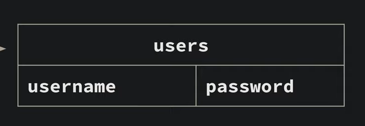

### INSERT INTO

if we want add data to table we use this operation 

```sql
INSERT INTO <table> VALUES (<values>)
```

```sql
INSERT INTO users VALUES ('admin', 'admin') 
```

output : 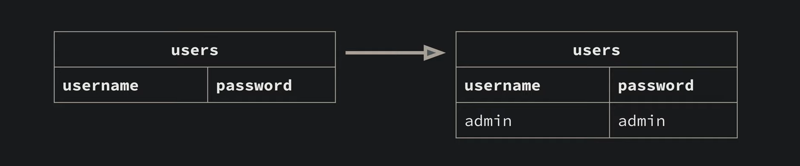

### SELECT

if you want to query the tables we use this operation 

```sql
SELECT <columns> FROM <table> WHERE <conditions>
```

```sql
SELECT username, password FROM users
```

this will return all the table with colums username and passowrords 

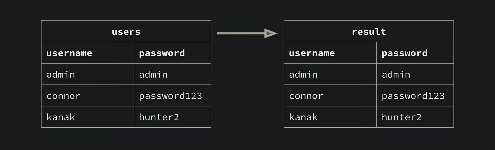

```sql
SELECT username FROM users
```

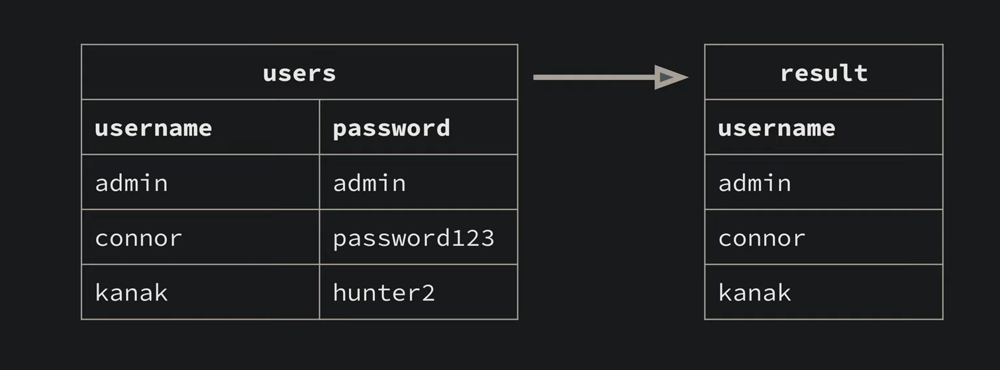

```sql
SELECT * FROM users
```

 if you don't want to specify the columns just use * 

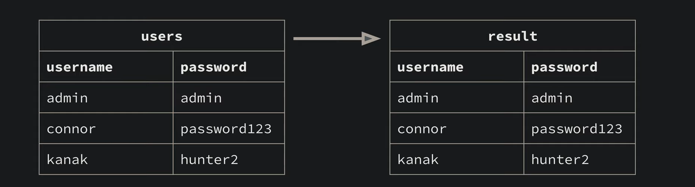

```sql
SELECT * FROM users WHERE username = 'admin'
```

if you want something specifc we use WHERE  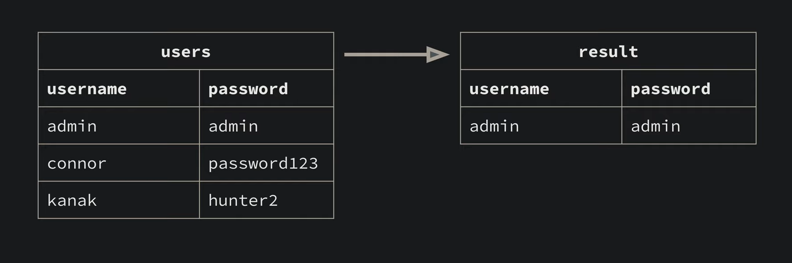

### DELETE

```sql
DELETE FROM <table> WHERE <conditions>
```

```sql
DELETE FROM users WHERE username = "kanak"
```

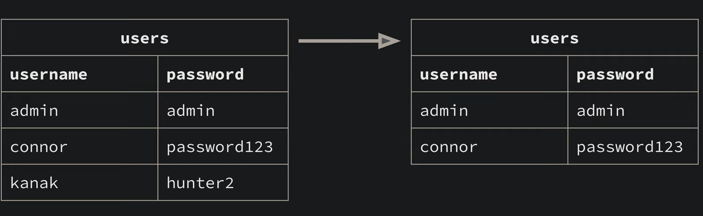

### UPDATE

rather than inserting if you want to update the existing data we do that using this operaiton

```sql
UPDATE <table> SET <assignments> WHERE <conditions> 
```

```sql
UPDATE users SET password = 'password456' WHERE username = 'connor'
```

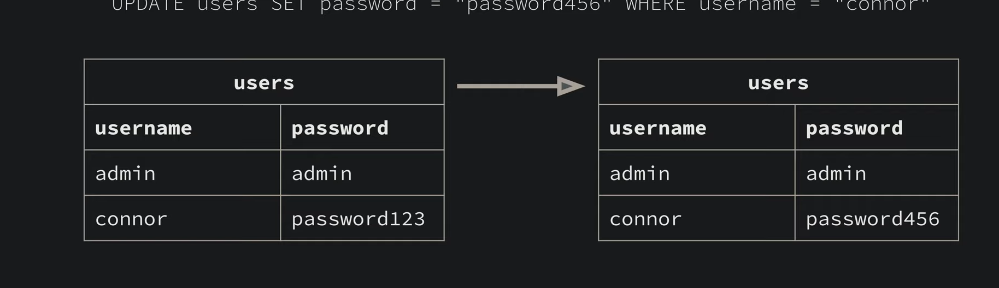

### UNION

```sql
<select> UNION <select>
```

if you want ot union to tables 

```sql
SELECT username FROM users UNION SELECT password FROM users 
```

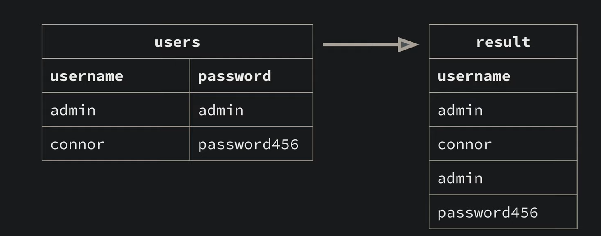

all get mereged into first selction atttribute names. 

### The Schema TABLE 

you have this default table , acts as blueprint that defines how data is logically organized and stored in a database. 

The schema for a databse is a description of all the other tables, indexes, triggers, and view that are contianed within the database. 

```sql
SELECT tbl_name FROM sqlite_master 
```

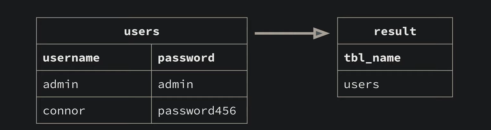

### DROP TABLE

if you want to complelty gget rid of table. 

```sql
DROP TABLE <table> 
```

```sql
DROP TABLE users 
```

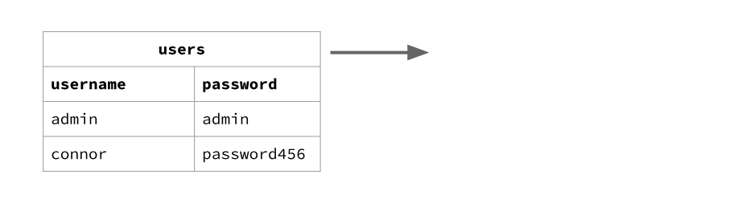

The key idea is that **WHERE ** ***filers rows*** and **SELECT ** ***chooses columns***

### The `%` wildcard

In SQL:

```

%
```

means:

> "zero or more characters"

Examples:

| Pattern   | Matches                        |
| --------- | ------------------------------ |
| `'abc%'`  | `abc`, `abcd`, `abc123`        |
| `'%xyz'`  | `xyz`, `123xyz`                |
| `'%cat%'` | `cat`, `blackcat123`, `catdog` |

------

### For your challenge

The pattern is:

```

'pwn.college{%'
```

Breaking it down:

```

pwn.college{
```

must appear exactly at the beginning.

Then:

```

%
```

means "anything can follow".

So it matches:

```
pwn.college{abc}
pwn.college{hello}
pwn.college{fake_flag}
pwn.college{123456}
```

### LIMIT 

it is used to restrict the maximum number of rows that a query returns 

```sql
SELECT <column> FROM <table> LIMIT <no_of_rows>;
```

```sql
SELECT content FROM repository WHERE content LIKE 'pwn.college{%' LIMIT 1;
```

## Querying Metadata : 

we can find out the information fo the table thourght this : 

```sql
SELECT sql FROM sqlite_masters 
```

