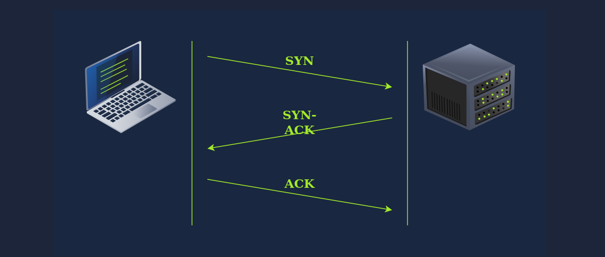

## OSI model 

OSI open system interconnectoin model is  conecputal model developed by iso international orgs for standardization. it tell how communication should occur in a computer network. There are seven layers in them : 

1. physcial layer

2. data link layer

3. network layer

4. transport layer

5. session layer

6. presentation layer

7. application layer

   refer the notes made by me in computer networks calss phyical book  
   i will cover the topics that i have i not cover there in that note book 

| Layer Number | Layer Name         | Main Function                                         | Example Protocols and Standards           |
| ------------ | ------------------ | ----------------------------------------------------- | ----------------------------------------- |
| Layer 7      | Application layer  | Providing services and interfaces to applications     | HTTP, FTP, DNS, POP3, SMTP, IMAP          |
| Layer 6      | Presentation layer | Data encoding, encryption, and compression            | Unicode, JPEG, PNG, MPEG                  |
| Layer 5      | Session layer      | Establishing, maintaining, and synchronising sessions | NFS, RPC                                  |
| Layer 4      | Transport layer    | End-to-end communication and data                     | TCP, UDP                                  |
| Layer 3      | Network layer      | Logical addressing and routing between networks       | IP, ICMP, IPSec                           |
| Layer 2      | Data link layer    | Reliable data transfer between adjacent nodes         | Ethernet (802.3), WiFi (802.11)           |
| Layer 1      | Physical layer     | Physical data transmission media                      | Electrical, optical, and wireless signals |

## 	Telnet

teletype network protocl is a network protocol for remote terminal connection. 

## IP Addresses (IPv4)

- An IP address is a unique identifier for every device on a network, similar to home postal address.
- IPv4 addresses consists of 4 octets (32bits), each ranging from 0-255(eg. 192.168.0.1)
- The Total possible unique address in ipv4 is approx 4 billion
- The first address in a range is Network address and the last is the broadcaset address. 

Checking your IP 

```
windows : ipconfig
linux/unix: ifconfig or ip a
```

- a subnet mask of 255.255.255.0 is equivalent to /24, meaning the first 3 octets are fixed accross the subnet

### public ip vs private ip 

**public ips**: are accessible from the internet.

**private ips** : are for interenal networks only and cannot direclty reach the interent.

- The three private ip ranges are : 
  - 10.0.0.0 - 10.255.255.255
  - 172.16.0.0 - 172.32.255.255
  - 192.168.0.0 - 192.168.255.255
- A router with NAT ( Network Address Translation) is needed for private ips to access the internet

### ROUTING 

- A router works like apost office - it forwards data packets towared their deesitnation
- packets typically pass thorugh mulitple routers before reaching the final destination
- routers operate at layer 3 and make decisions based on ip addresses.

## UDP ( User Datagram Protocol)

- A **connectionless** transport protocol operating at **Layer 4**
- Does **not** require establishing a connection before sending data
- Provides **no delivery confirmation** — no guarantee the packet was received
- Analogy: like sending a letter via standard mail with **no delivery confirmation**
- Faster than TCP due to its simplicity and lack of acknowledgement mechanism

## **TCP (Transmission Control Protocol)**

- A **connection-oriented** transport protocol, also at **Layer 4**
- Ensures **reliable data delivery** through various built-in mechanisms
- Requires a connection to be **established before** any data is sent
- Each data octet has a **sequence number**, making it easy to detect lost or duplicate packets
- The receiver sends back an **acknowledgement number** to confirm received data

**TCP Three-Way Handshake**

- Used to establish a TCP connection using two flags — **SYN** and **ACK**
  1. **SYN** — Client sends a SYN packet with its initial sequence number
  2. **SYN-ACK** — Server responds with its own sequence number
  3. **ACK** — Client acknowledges the server's response; connection is established



**Port Numbers (Both TCP & UDP)**

- Port numbers identify the **specific process** sending or receiving data on a host
- Uses **2 octets**, so valid range is **1 to 65535** (port 0 is reserved)
- Formula: 2¹⁶ − 1 = 65535

## Encapsulation

- The process where each layer adds a header to the data it receives befoore passing it to the layer below

**Encapsulation Steps (Sender Side)**

1. **Application Data** — User generates data (e.g., writing an email) and the application formats and sends it down to the transport layer
2. **Transport Layer (Segment/Datagram)** — TCP or UDP adds its header, creating a **segment** (TCP) or **datagram** (UDP), passed down to the network layer
3. **Network Layer (IP Packet)** — An **IP header** is added to the segment/datagram, forming an IP packet, passed down to the data link layer
4. **Data Link Layer (Frame)** — Ethernet or WiFi adds a **header and trailer**, creating a **frame** for physical transmission

- On the **receiving end**, this process is **reversed** layer by layer until the original application data is extracted