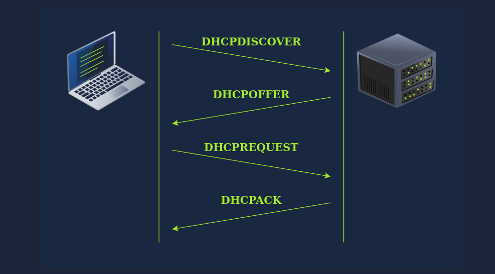
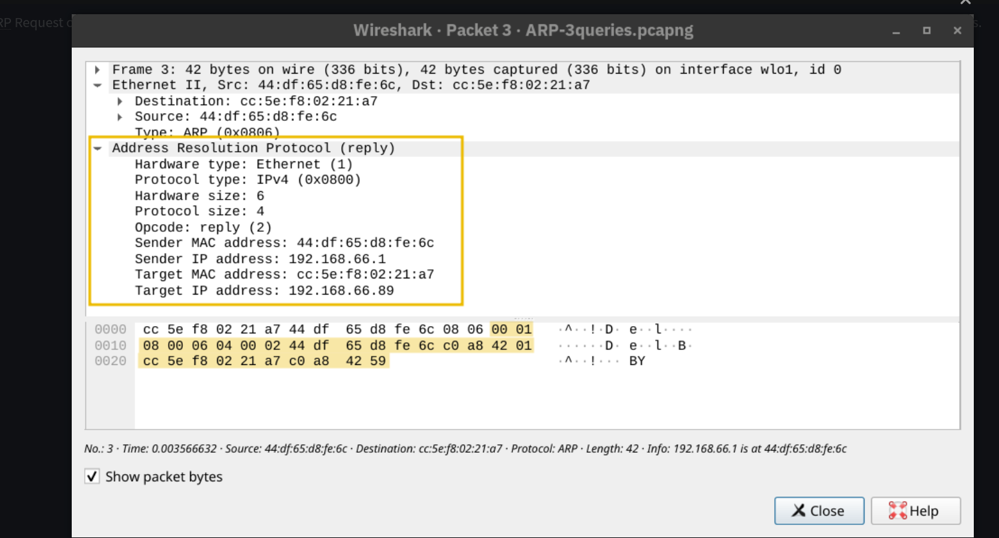
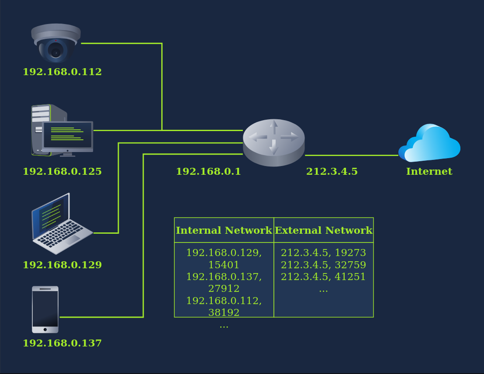

Whenever we want to access a network, at the very leat, we need to configure the following : 

- IP address along with subnet mask
- router
- DNS server

so when we conncet our devce to a new network, the above config must be set acco to the new network. 

- When you connect to a new network, your device needs proper network setting like an ip addres, subnet mask, gateway
- doing this manually eveyr time is tedious, especially for mobile devices that switch network freqently
- manual config also risk ip address conflicts - when two device accidentally get assigned the same ip , which breaks the network access for both
- SO this porblem is solved by the **DYnamic Host Configuration Protocol**

## DHCP

- is an applicaiton level protocl that automatically assigns network configurations to devices when they connect to a network
- your smartphone and laptop are set to use DHCP by default 
- when a device connects to a network, DHCP allows it to obtain an ipaddress, subnet mask, default gateway and dns server settings wihtout manual config. 

THis is accomplished through a sequence of four steps know as **DORA**

- **Discover**
  - The client has **no IP address yet**, only a MAC address
  - It broadcasts a **DHCPDISCOVER** message from `0.0.0.0` to `255.255.255.255` (broadcast)
  - Essentially asking *"Is there a DHCP server on this network?"*
- **Offer**
  - The DHCP server responds with a **DHCPOFFER** message
  - It offers an **available IP address** along with network configuration
  - Uses the client's **MAC address** to direct the response
- **Request**
  - The client broadcasts a **DHCPREQUEST** message
  - This confirms that it has **accepted the offered IP address**
  - Still sent from `0.0.0.0` because the IP isn't officially assigned yet
- **Acknowledge**
  - The server sends a **DHCPACK** message
  - This **confirms and finalizes** the IP address assignment to that client



```bash
           
user@TryHackMe$ tshark -r DHCP-G5000.pcap -n
    1   0.000000      0.0.0.0 → 255.255.255.255 DHCP 342 DHCP Discover - Transaction ID 0xfb92d53f
    2   0.013904 192.168.66.1 → 192.168.66.133 DHCP 376 DHCP Offer    - Transaction ID 0xfb92d53f
    3   4.115318      0.0.0.0 → 255.255.255.255 DHCP 342 DHCP Request  - Transaction ID 0xfb92d53f
    4   4.228117 192.168.66.1 → 192.168.66.133 DHCP 376 DHCP ACK      - Transaction ID 0xfb92d53f

        
```

This shows example 

**Reading the Packet Capture**

- Packets 1 & 3 → sent from `0.0.0.0` to `255.255.255.255` (client has no IP yet)
- Packets 2 & 4 → sent from `192.168.66.1` (server) to `192.168.66.133` (offered IP)
- All four packets share the same **Transaction ID** (`0xfb92d53f`) to keep the exchange linked

**What the Client Receives After DORA** By the end of the process, the client is fully configured with:

- A **leased IP address** to access network resources
- A **gateway address** to route traffic outside the local network
- A **DNS server address** to resolve domain names into IP addresses

## ARP (Address Resoultion Protocol):

- when two device communicate over a network, an IP packet is wrapped inside a data link frame ( ethernet or wifi)
- the frame header requires both source and desitnation MAC addresses
- Devices always know each other's ip addresses but not necessarily their mac addresses. so this problem is solved by the arp 

**How ARP Works — Two Steps**

1. **ARP Request**
   - The device that wants to communicate broadcasts a message to **all devices** on the network (`ff:ff:ff:ff:ff:ff`)
   - Essentially asking *"Who has IP address 192.168.66.1? Tell me your MAC address!"*
   - Sent from the requester's MAC address to the broadcast MAC address
2. **ARP Reply**
   - The device with the matching IP address **responds directly** with its MAC address
   - Example: *"192.168.66.1 is at 44:df:65:d8:fe:6c"*
   - After this, both devices can freely exchange data link frames



## ICMP (internet control message protocol)

- icmp is manily used for network diagonstics and error reporting
- it is the backbone of two very popular network troubleshooting tools - **ping** and **traceroute**

**PING**

- Ping tests **connectivity** between your device and a target system

- It measures the **Round-Trip Time (RTT)** — how long it takes for a packet to go and come back

- Works by sending an **ICMP Echo Request (Type 8)** and waiting for an **ICMP Echo Reply (Type 0)**

  reading the ping output 

  ```bash
  ┌──(wrongmanoff㉿wrongmanoff)-[~/Documents/NOTES]
  └─$ ping google.com
  PING google.com (2404:6800:4000:100c::8a) 56 data bytes
  64 bytes from pt-in-f138.1e100.net (2404:6800:4000:100c::8a): icmp_seq=1 ttl=113 time=31.2 ms
  64 bytes from pt-in-f138.1e100.net (2404:6800:4000:100c::8a): icmp_seq=2 ttl=113 time=49.1 ms
  
  ```

  - icmp_seq ; sequence number of the packet
  - ttl : time to live value
  - time : round-trip time in milliseconds

at the end it shows : 

```
--- google.com ping statistics ---
5 packets transmitted, 5 received, 0% packet loss, time 4005ms
rtt min/avg/max/mdev = 27.240/41.445/48.421/7.417 ms

```

- Total packet send vs received 
- packet loss %
- min /avg/ max standard deviation of rtt

**TRACEROUTE**

- Maps the **entire route** a packet takes from your device to the destination
- Called `traceroute` on Linux/Unix and `tracert` on Windows

**How it Works — Using TTL:**

- Every IP packet has a **TTL (Time-to-Live)** field — the maximum number of routers it can pass through
- Each router **decrements TTL by 1** before forwarding the packet
- When TTL reaches **zero**, the router **drops the packet** and sends back an **ICMP Time Exceeded message (Type 11)**
- Traceroute cleverly exploits this by starting with TTL=1, then TTL=2, and so on — forcing each router to reveal itself one by one

### Reading Traceroute Output:

```
1  _gateway (192.168.66.1)       4.4 ms   → Your local router
2  192.168.11.1                  5.8 ms   → Next hop
5  * * *                                  → Router didn't respond
16 93.184.215.14                 140 ms   → Destination reached
```

- Each line = one router (hop) along the path
- Three time values = **three separate probes** sent to that router
- `* * *` = router **didn't respond** (blocked ICMP or configured to ignore)

**What Traceroute Can Reveal:**

- **Private IP addresses** of ISP routers
- **Public IP addresses** and their geographic locations via domain name lookup
- **Where delays or drops** are happening in the network

## Routing 

**How Routing Works — Simple Idea**

- Each router maintains a **routing table** — a list of known networks and the best path to reach them
- When a packet arrives, the router checks its routing table and **forwards it to the next best hop**
- This repeats across multiple routers until the packet **reaches its destination**

R**outing Protocols — Overview**

**1. OSPF (Open Shortest Path First)**

- Routers share information about their **connected links and network topology**
- Each router builds a **complete map of the entire network**
- Uses this map to calculate the **most efficient (shortest) path** to any destination
- Best suited for **medium to large networks**

**2. EIGRP (Enhanced Interior Gateway Routing Protocol)**

- A **Cisco proprietary** protocol (works only on Cisco devices)
- Routers share information about reachable networks and their **cost** (bandwidth, delay, etc.)
- Combines aspects of multiple routing algorithms for **efficient path selection**
- Good for **Cisco-based enterprise networks**

**3. BGP (Border Gateway Protocol)**

- The **backbone protocol of the Internet**
- Used between **different organizations and ISPs** to exchange routing information
- Helps route data **across multiple networks** worldwide
- Ensures packets can travel efficiently even when crossing **many different networks**

**4. RIP (Routing Information Protocol)**

- The **simplest** routing protocol
- Routers share which networks they can reach and how many **hops (routers)** it takes to get there
- Always chooses the route with the **fewest hops**
- Best suited for **small, simple networks**
- Not ideal for large networks due to its simplicity

**Quick Comparison Table**

| Protocol | Best For              | Key Metric      | Notes             |
| -------- | --------------------- | --------------- | ----------------- |
| OSPF     | Medium/Large networks | Shortest path   | Open standard     |
| EIGRP    | Cisco networks        | Bandwidth/Delay | Cisco only        |
| BGP      | The Internet          | Policy-based    | Connects ISPs     |
| RIP      | Small networks        | Hop count       | Simplest protocol |

## NAT ( Network Address Translation)

- NAT allows one single public IP address to provide internet access to many devices wiht private IP Addresses. 
- ex : a company wiht 20 computers only need 1 public ip address instead of 20
- THe router acts a middleman between teh private internal network and the public network  

**How NAT Works**

- Devices on the internal network use **private IP addresses** (e.g., `192.168.0.x`)
- The router has a **single public IP address** (e.g., `212.3.4.5`)
- When a device sends traffic to the internet, the router **translates** the private IP and port to the public IP and a unique port number
- When a response comes back, the router **reverses the translation** and forwards it to the correct internal device



The router maintains a **translation table** to track all ongoing connections:

| Internal IP   | Internal Port | External IP | External Port |
| ------------- | ------------- | ----------- | ------------- |
| 192.168.0.129 | 15401         | 212.3.4.5   | 19273         |
| 192.168.0.130 | 23401         | 212.3.4.5   | 19274         |