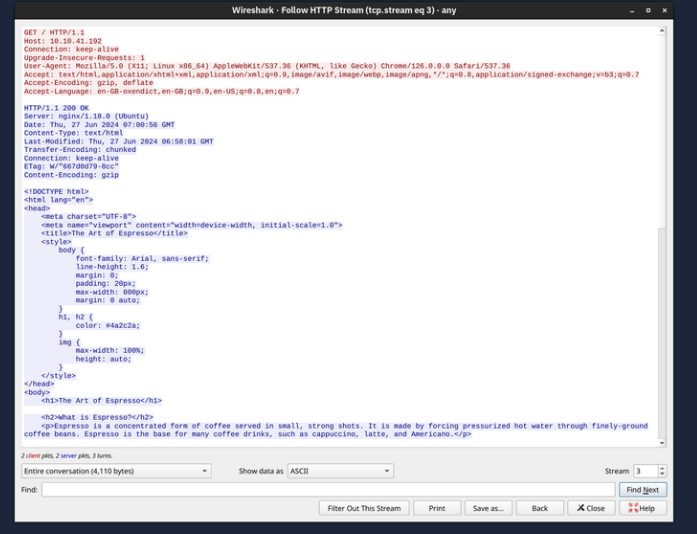
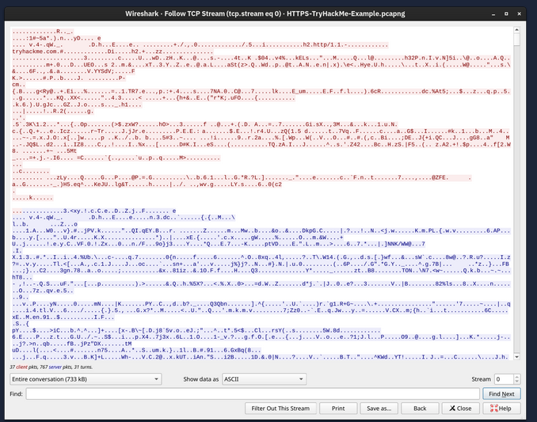

Previously we have covered the core protocls but it did not include the saftey of confidentiallity, integrity or authencity of the data that is being transfered. 

SO TLS (Transport Layer Securiyt) is added to existing protocols to protect teh communications confidentiality, integrity and authenticity. so : 

- HTTP - HTTPS
- SMTP - SMTPS
- POP3 - POP3S 
- IMAP - IMPAS

so simillary telnet's secure version is SSH ( secure SHELL) it was the most secure way to access remote systems; 

## TLS ( transport layer security)

It all began in the 1990's Netscape communications have eventually developed the SSL ( secure Sockets Layer) SSL have been released in 1995. In 1999 Internet Engineering Tast FOrce ( IETF) developed teh TLS 

TLS is a cryptographic protocol operating at the OSI model's transport layer. it bascially allows secure communications between client and server. It ensure no one read or modity the exchanged data. 

Here is a basic over how tls works : 

- Every server (or client) that wants to prove its identity must first obtain a **signed digital certificate**.
- The server administrator creates a **Certificate Signing Request (CSR)**.
- The **CSR** is submitted to a **Certificate Authority (CA)**.
- The **CA** verifies the information in the CSR.
- If the verification is successful, the **CA issues and signs a digital certificate**.
- The signed certificate is then installed on the server (or client).
- This certificate is used to **identify and authenticate** the server (or client) to other systems.
- Other systems verify the certificate by checking the **CA's digital signature**.
- To perform this verification, the system must already have the **trusted CA certificates** installed.
- These trusted CA certificates act as a list of authorities whose signatures are considered valid.
- **Real-world analogy:** This is similar to recognizing and trusting the official stamps or seals of well-known government authorities or organizations.

## HTTPS ( hyper text transfer protocol secure)

the normal work of the http web page looks like this : 

1. resolving the domain name to an ip address 

2. establish a tcp three-way handshake wiht the target server

3. communciate using the http procotl such as `GET / HTTP/1.0` 

   it looks like this 

now we add a security layer using tls so now it looks like this : 

1. resolving the domain name to an ip address
2. establish a tcp three -way handshake wiht the target server
3. establish a TLS session 
4. communicate using the http protcol

it looks like this : 

the exchanged traffic is encrypted the red is sent by the client and blue is the sent by the server. we cannot read it with out an **encryption key.**

## SMPTS, POP3S and IMAPS

he insecure versions use the default 

 port numbers shown in the table below:

| Protocol | Default Port number |
| -------- | ------------------- |
| HTTP     | 80                  |
| SMTP     | 25                  |
| POP3     | 110                 |
| IMAP     | 143                 |

The secure versions, i.e., over TLS, use the following TCP port numbers by default:

| Protocol | Default Port Number |
| -------- | ------------------- |
| HTTPS    | 443                 |
| SMTPS    | 465 and 587         |
| POP3S    | 995                 |
| IMAPS    | 993                 |

## SSH (Secure Shell Protocl)

TELNET has major security problems like anyone can get your login credentials easily. so the solution for this was **SSH** it was first released in 1995as a freeware. A few years laters in 1999 OpenBSD developers realeased the OpenSSH, this is mostly used in ssh 

OpenSSH features : 

- Secure Authentication : along with password authentication, SSH supports public key and 2FA 
- Confidentiality: It has end-to end encryption
- Integrity
- TUnneling: it can create a secure tunnel to route other protocls thorugh ssh. 
- X11 Forwarding: if you connect to a unix like system with gui, ssh allows you to use the gui over the network 

THe command used looks like this : `ssh username@hostname`

SSH server listens on port 22

## SFTP and FTPS 

SFTP stands for SSH File Transfer Protocl and allows secure file transerf. It is a part of ssh. WE could use it as `sftp username@hostname` 

FTPS stands for File Transfer Protocl secure as we seen earlier it also uses the TLS it usually uses port 990

## VPN (virtual private network)

- VPN is like a user is in different country and main office is in different corunty so they use vpn to securley connect to a company's main network over the internet.
- "**vitrual**" means the connection uses the public internet instead of dedicated physcial cables.
- The internet TCP/IP protocl is designed to deliver data reliably but does not provide privacy by default 
- "**private**" mean like encrypting data so that it cannot be read or modified by unauthorized 

A vpn requires : 

- Interent connectivity 
- A **VPN server** (usally at main office)
- A **VPN client** ( users's device)

SO when connected: 

- The VPN client encrypts traffice before sending it through a secure vpn tunnel
- the VPN server decrpyts the traffic befoer it reaches the internal network 

VPN can be used in two ways: 

    1. **Site-to-site vpn**: COnnects entire branch office to the main office 
    1. **Remote-acces vpn**: COnnects an individual device to the company network 

Many VPNs route **all Internet traffic** through the VPN server. As a result:

- Websites see the **VPN server's IP address** instead of the user's real IP.
- Users can appear to be browsing from another country (e.g., Japan) and bypass some geographic restrictions.
- The local ISP only sees encrypted traffic, improving privacy and making censorship more difficult.