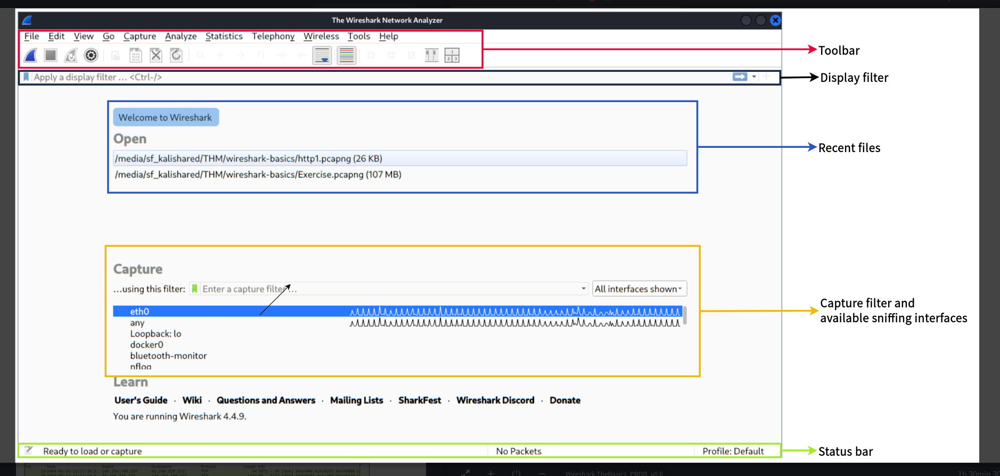
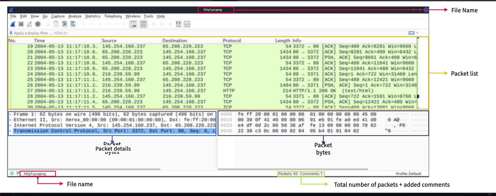
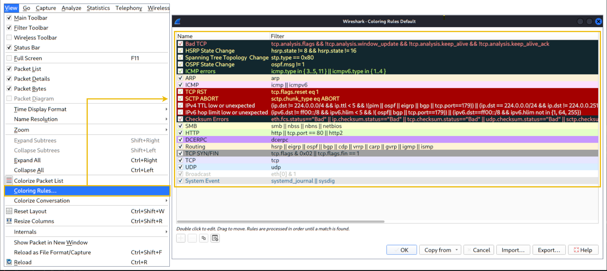
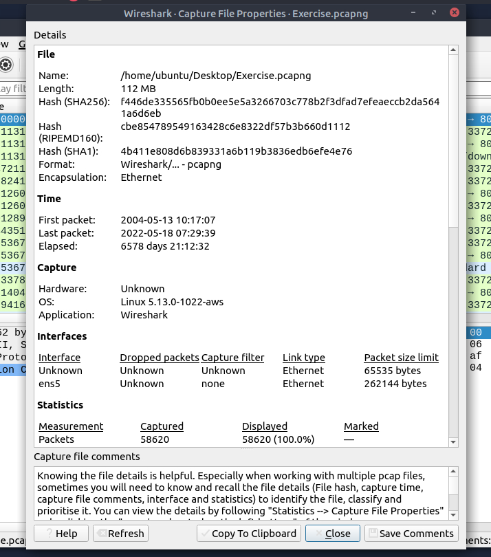

# WIRESHARK

IT's basically a traffic analyser tool. It does all this : 

- Detecting and troubleshooting the network problems.
- Detecting security anomalies.
- Investigae and leraning protocol details. 

Wireshark is not an ids. it just observer packets but not modify it 

| **Toolbar**                       | The main toolbar contains multiple menus and shortcuts for packet sniffing and processing, including filtering,  sorting, summarising, exporting and merging. |
| --------------------------------- | ------------------------------------------------------------ |
| **Display Filter Bar**            | The main query and filtering section.                        |
| **Recent Files**                  | List of the recently investigated files. You can recall listed files with a double-click. |
| **Capture Filter and Interfaces** | Capture filters and available sniffing  points (network interfaces). The network interface is the connection  point between a computer and a network. The software connection (e.g.,  lo, eth0 and ens33) enables networking hardware. |
| **Status Bar**                    | Tool status, profile and numeric packet information.         |

in the file menu we need to choose a file. After choosing the file and opening the interface looks like this 

 

| Packet List Pane     | Summary of each packet (source and destination addresses, protocol,  and packet info). You can click on the list to choose a packet for  further investigation. Once you select a packet, the details will appear in the other panels. |
| -------------------- | ------------------------------------------------------------ |
| Packet Details Panel | Detailed protocol breakdown of the selected packet.          |
| Packet Bytes Pane    | Hex and decoded ASCII representation of the selected packet. It  highlights the packet field depending on the clicked section in the  details pane. |

### Colouring packets

- wireshark colors the packets in order of different conditions and the protocol to spot anomailies and protocl in captures qucikly 
- we can create custom color rules to spot events of interest by using display filters

Wireshark has 2 types of coloring methods: 

1. Tempory rules that are available during a program session 
2. Permanent rules that are saved under the prefrence file (profile) and are available every time

For setting up these you need follow this : 

- premanent rules setting up : 
  1. **"View --> Coloring Rules"** menu to create permanent colouring rules
- temporary rules setting up : 
  1. **"View --> Conversation Filter"** menu,

For activating and deactivating the colouring rules you need to do this "**Colourise Packet List**"

### Traffic Sniffing

We need to use blue "**Shark Button**" to start the network sniffing ( cpaturing traffic ), the red button will stop the sniffing. and green button will restart the sniffing process. 

### Merge PCAP Files

wireshark can combine two pcap files into one single file. we can do it by : "**File --> Merge**" 

### View File Details 

we can find out the deatils about our working file in this section: "**Statistics --> Capture File Properties**" or by clicking the "**pcap icon located on the left bottom**"

