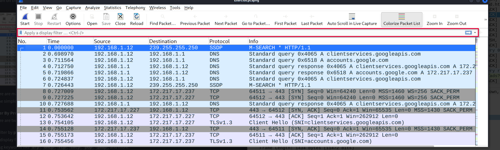

## Packet Filtering

Wireshark has two types of filtering methods 

1. capture filter : are used for capturing only the packets valid for the used filters
2. display filter : are used for viewing the packets valid for the used filters. 

### APply as Filter 

most basic way of filtering traffic. can do it by  **"Analyse** **--> Apply as Filter"** 

### Conversation filter

if we want to investigate a specific packet numebr and all linked packets by focusing on Ip address and port numbers. "**Analyse --> Conversation Filter**" 

### Prepare as filter 

Similar to "Apply as Filter", this option helps analysts create display  filters using the "right-click" menu. However, unlike the previous one,  this model doesn't apply the filters after the choice. It adds the  required query to the pane and waits for the execution command (enter)  or another chosen filtering option by using the **".. and/or.."** from the "right-click menu".

### Follow Stream

Wireshark displays everything in packet  portion size. However, it is possible to reconstruct the streams and  view the raw traffic as it is presented at the application level.  Following the protocol, streams help analysts recreate the  application-level data and understand the event of interest. It is also  possible to view the unencrypted protocol data like usernames, passwords and other transferred data.

You can use the"right-click menu" or **"Analyse** **--> Follow TCP/UDP/HTTP Stream"** menu to follow traffic streams. Streams are shown in a separate dialogue  box; packets originating from the server are highlighted with blue, and  those originating from the client are highlighted with red.

### Simple display filter queries 



#### . Filter by Protocol Name

- Shows packets belonging to a specific protocol.
- **Syntax:**

```
<protocol_name>
```

**Examples:**

- ```
  http
  dns
  arp
  ftp
  smtp
  dhcp
  pop
  imap
  ```

- Useful when you want to analyze traffic for a particular protocol only.

------

#### 2. Filter by Port Number

- Shows packets using a specific TCP or UDP port.
- **TCP Syntax:**

```
tcp.port == <port_number>
```

**UDP Syntax:**

```
udp.port == <port_number>
```

**Examples:**

- ```
  tcp.port == 80      # HTTP
  tcp.port == 443     # HTTPS
  udp.port == 53      # DNS
  tcp.port == 22      # SSH
  tcp.port == 21      # FTP
  ```

- Useful for finding traffic associated with a specific service.

------

#### 3. Filter by IP Address

- Shows packets sent to or received from a specific IP address.
- **Syntax:**

```
ip.addr == <IP_address>
```

**Example:**

- ```
  ip.addr == 192.168.1.2
  ```

- Displays both incoming and outgoing traffic involving that IP.

------