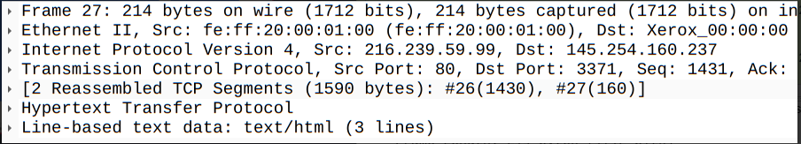
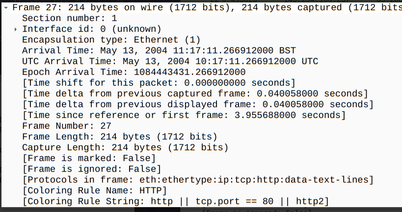
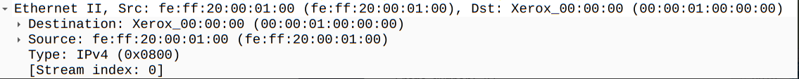
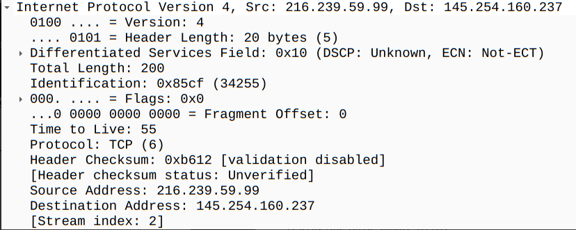
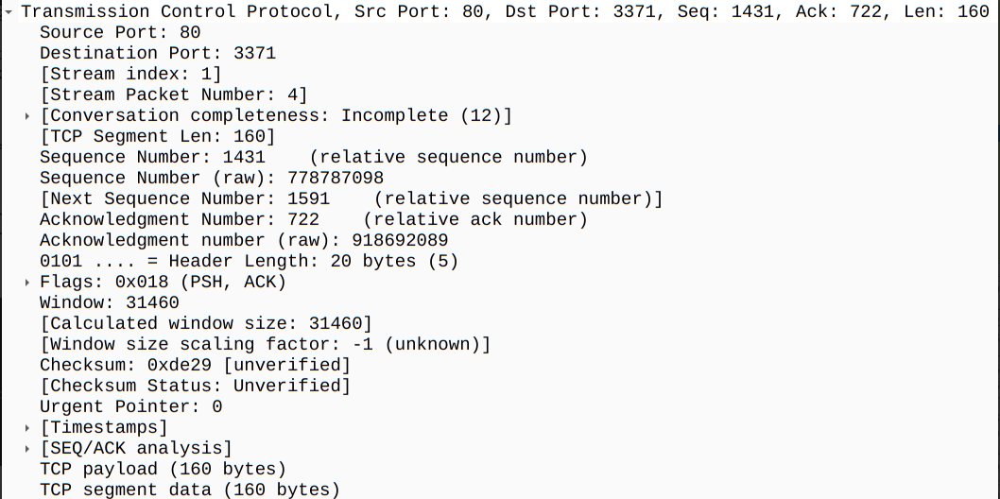
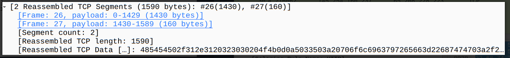
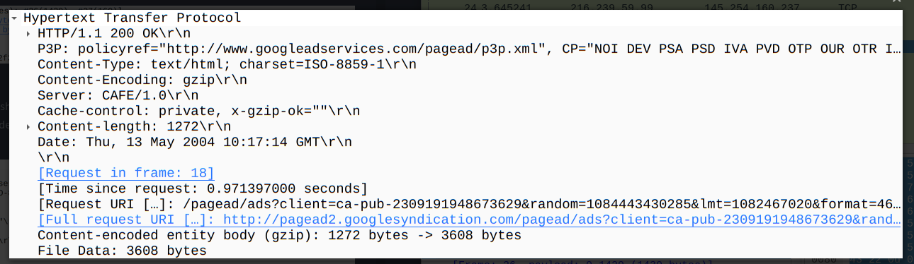
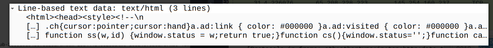

# **packet dissection**

packet dissection is also know as protocol dissection, which means investigating packet deatils by decoding avaible protocols and fields. 

### Packet Deatils

we can know more details about a packet by double clicking on packet on the packet list pane so a new windows opens about the deatils. 

For each packet there are seven distinct layers to the packet: 

1. `frame/packet`
2. `source [MAC]`
3. `source [IP]`
4. `protocol`
5. `protocol errors`
6. `application protocol`
7. `application data` 

##### The Frame (layer 1)

this will show what frame/packet we are looking at and details specific to the physical layer of the OSI model 

##### Source[MAC] ( layer 2 )

this will show the source and destination MAC address, from teh data link layer 

##### Source[IP] ( Layer 3 )

this iwll show the source and destination IPv4 address, from teh network layer 

##### Protcol ( layer 4)

this will show the details of the protocol used (UDP/TCP) and source & destination ports, from transporation layer of the osi model 

##### protocl errros

this is the continuation of layer 4 show specific segments from the TCP that needs to be reassembled 

##### Application protocl (layer 5)

this will show details specific to the protocols used, such as HTTP, FTP, and SMB. from the application layer of the osi model

##### Application Data

this is an extension of 5th layer can show the appliation-specific data. 