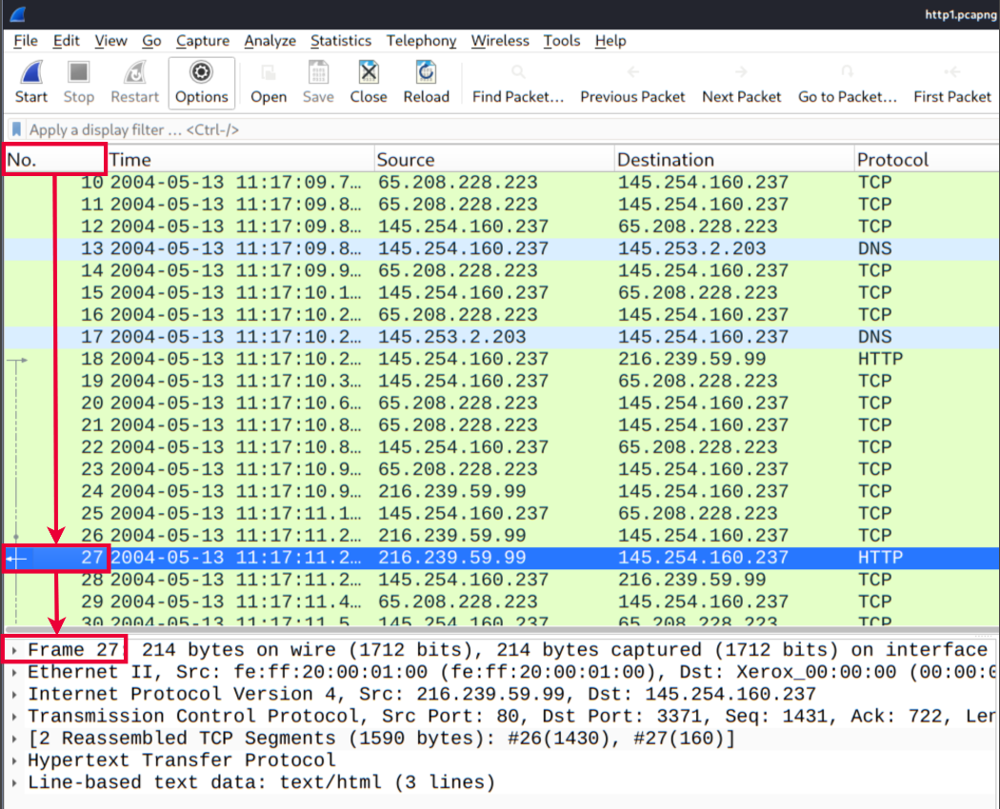
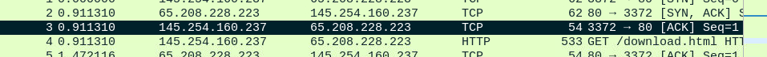
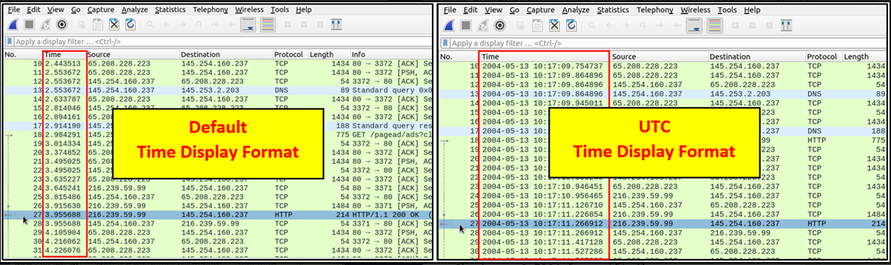

### packet numbers

wireshark assings unique number for every individual packets 

### Go to packet

we can travel to a specifc packet using the Go features avaible in the satus bar

### Find packets 

we can find specifc packets by jst simplying doing `ctrl+f` or else "**Edit ---> find packet**" 

so here in this function we can do many things like we can give many different inputs 

### Mark packets 

this is another usefull function. it bascially does liek we can point or mark a specifci packet for futher investigation.

Marked packets will be shown in black regardless of teh original color representing the connection type. 

### Packet Comments

basicallly we can add comments for particular packets we can do  by right click on a packet and you see packet comment do it 

### Export Packets 

we can use the "**File**" mento to export packets 

### Export objects

we can extract files transferred through the wire. we can do by using the "**File**" menu 

### TIme display format 

By default, Wireshark shows the time in "Seconds Since Beginning of Capture", the common usage is using the  Time Display Format for a better view. You can use the **"View --> Time Display Format"** menu to change the time display format.

### Expert Info 

You can use the **"lower left bottom section"** in the status bar or **"Analyse --> Expert Information"** menu 

| **Severity** | **Colour** | **Info**                                                 |
| ------------ | ---------- | -------------------------------------------------------- |
| **Chat**     | **Blue**   | Information on usual workflow.                           |
| **Note**     | **Cyan**   | Notable events like application error codes.             |
| **Warn**     | **Yellow** | Warnings like unusual error codes or problem statements. |
| **Error**    | **Red**    | Problems like malformed packets.                         |

| **Group**    | **Info**                 | **Group**      | **Info**                   |
| ------------ | ------------------------ | -------------- | -------------------------- |
| **Checksum** | Checksum errors          | **Deprecated** | Deprecated protocol usage  |
| **Comment**  | Packet comment detection | **Malformed**  | Malformed packet detection |