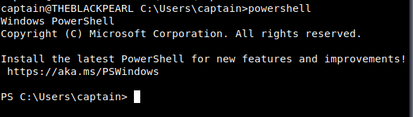

THis is only the command line built for the windows operating system. 

## What is PowerShell?

- Cross-platform task automation and configuration management tool by Microsoft.
- Includes:
  - Command-line shell
  - Scripting language
  - Configuration management framework
- Works on:
  - Windows
  - macOS
  - Linux
- Built on the .NET framework.
- Object-oriented unlike traditional text-based command-line tools.

------

## Why PowerShell Was Created

- Traditional Windows tools like `cmd.exe` and batch scripting had limitations.
- Enterprises needed:
  - Better automation
  - Advanced system management
  - Interaction with modern Windows APIs
- Microsoft wanted a more powerful administrative tool.

------

## History of PowerShell

- Developed by Jeffrey Snover.
- Released in 2006.
- Inspired by differences between:
  - Windows → structured data & APIs
  - Unix → text-based systems
- Introduced an object-oriented approach to system administration.
- In 2016, Microsoft released PowerShell Core:
  - Open-source
  - Cross-platform support for Windows, macOS, and Linux

------

## What Makes PowerShell Powerful

- Uses **objects** instead of plain text.
- Objects contain:
  - **Properties** → data/characteristics
  - **Methods** → actions/functions

### Example of an Object

A car object may contain:

- Properties:
  - Color
  - Model
  - FuelLevel
- Methods:
  - Drive()
  - HonkHorn()
  - Refuel()

------

## PowerShell Objects

- PowerShell objects can represent:
  - Files
  - Users
  - Processes
  - System components
- Objects keep their data and functionality together.

### Examples

Properties:

- File name
- User name
- File size

Methods:

- Copy a file
- Stop a process

------

## Cmdlets in PowerShell

- Commands in PowerShell are called **cmdlets** (“command-lets”).
- Cmdlets return objects instead of plain text.
- Benefits:
  - Easier data handling
  - More advanced automation
  - No need for text parsing
  - Better system integration

------

## laching the powershell

launching the powershell can be down by : 


## basic cmdlets 

to list all available cmdlets, functions, aliases, and scripts that can be executed in the current powershell session, we can use : 

```powershell
Get-Command
```

