# active directory

## windows domains

windows domain is a group of users and computers under the administration of a given businees. it basically a centralised system to manage everything : instead of managing 147 computers individually, you control everything at one place. the core of domain is : 

**active directory (ad): ** it acts like a database that stores : useres, computers, groups, permission, policies. like we can also define as the main idea behind a domian is to centralise the administration of common components of a windows ocmputer network into a single repo called active directroy ad 
**Active Directory Example**: 

- In school/university networks, users are given a **username and password**.
- These credentials can be used on **any computer across the campus**.
- When you log in, the computer does **not verify credentials locally**.
- Instead, it **forwards the authentication request** to Active Directory.
- Active Directory **checks whether the credentials are valid**.
- If valid, access is granted to the user.
- Because of this system, credentials **do not need to be stored on each individual machine**.
- This allows a **centralized authentication system across the entire network**.

**domain controller** : this is a server that runs ad, authenticates users, applies policies across the network.  

## ACTIVE DIRECTORY

The core of any windows domain is active directory domain service AD DS. It holds the information of all object that exist on our networks like : 

- users : these objects are also know as **security principal ** they can be authenticated by the domain and can be assinged privleges over resources like files and printers. 

- machines :  for every computer that join ad domain , a machine object will be created. these are also security principals and are assigned an account. this account has somewaht limited rights within the domain itself. 
  these machine follow a specif naming scheme : The machine account name is the computer's name followed by a dollar sign 

  ```
  for example a machine named DC01 
  will have a machine account called DC01$
  ```

  - Security groups :  there are user groups to assing access right to files or other resources to entire groups instead of singel users. so we can add users to an exisiting group, they will automatically inherit all of the group's privileges. security groups are also considered as security principals so they also have priv over resources on the network. 
    groups and can have both users + machines and it can also include other groups as well 

    Several groups are created by default in a domain that can be used to grant specific privileges to users. As an example, here are some of the most important groups in a domain:

    | **Security Group** | **Description**                                              |
    | ------------------ | ------------------------------------------------------------ |
    | Domain Admins      | Users of this group have administrative privileges over the entire  domain. By default, they can administer any computer on the domain,  including the DCs. |
    | Server Operators   | Users in this group can administer Domain Controllers. They cannot change any administrative group memberships. |
    | Backup Operators   | Users in this group are allowed to access any file, ignoring their  permissions. They are used to perform backups of data on computers. |
    | Account Operators  | Users in this group can create or modify other accounts in the domain. |
    | Domain Users       | Includes all existing user accounts in the domain.           |
    | Domain Computers   | Includes all existing computers in the domain.               |
    | Domain Controllers | Includes all existing DCs on the domain.                     |

## Active Direcotry Users and Computers

to configure users, machines, groups in ad we need to login to domain controller and run ad users and computers from the start menu. It will open up a windows where we can see hierarchy of users, computers etc 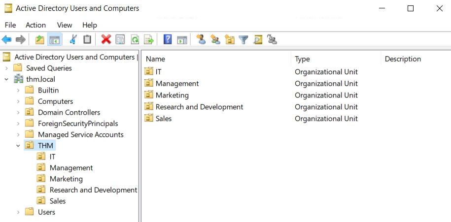 

these objects are organised by **Organizational Units (OUs)** which are container objects that allow you to classify users and machines. OUs are mainly used to define sets of users wiht similar policing requirements. 
OUs are handy for applying policies to users and computers, whcih include specific confgurations that pertain to sets of users depending ont heir particular role in the enterpriese

## rdp

lets se how to connec or do remote desktop connection in windows 

1. first open win+R (run ) and do this command : 

   ```
   mstsc
   ```

1. There then enter the computer address or name 
2. then username 
3. then password 
4. you are connected 

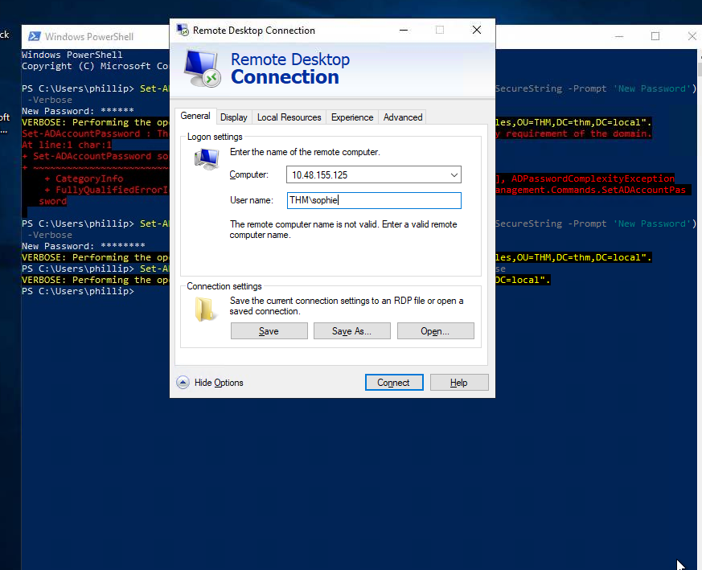

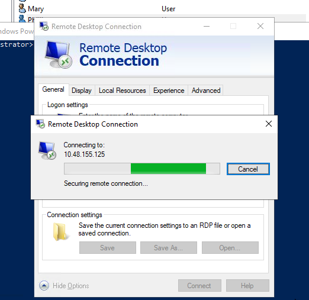

Here in this active directory users and computers we can only organize the users and cmputers but the main idea behind this to be albe to deploy different policies for each OU individually. that way, we can push different configurations and security baselines to users depending on their department.

## group policies : 

windows manages such policies thorugh **group policy objects (gpo)**. GPOs are simply a collection of setting that can be applied to OUs
we need to open group policy management tool from start menu 

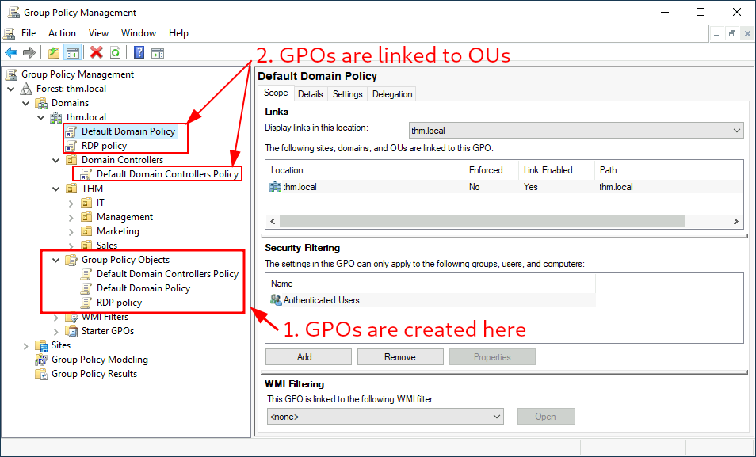

here we can see the default domain policay and rdp are linked to thm.local domain and the default domain controllers policy is linked to the domain controllers OU only. 

if we examine default domain policy 

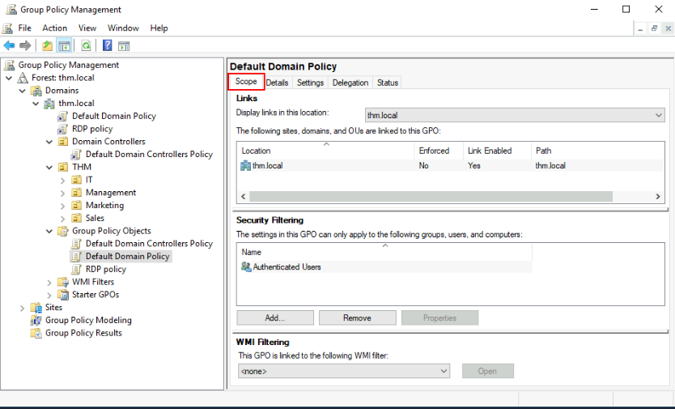

the setting tab include the actual contents of the gpo and lets us know what specific configuration it applies. 

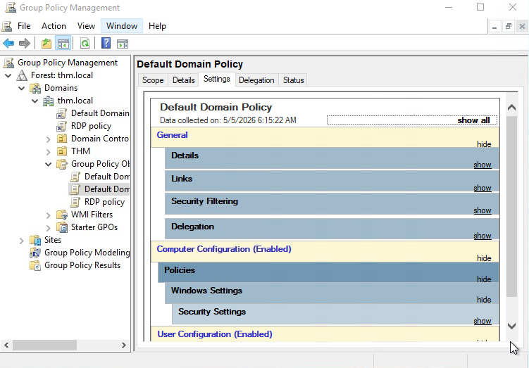

if we want to edit the policy do this : right click on policy 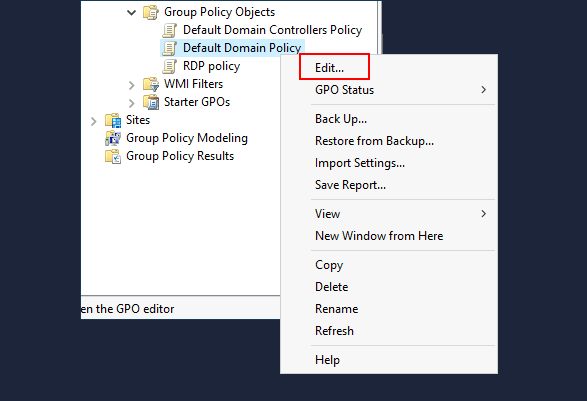

then follow this  `Computer Configurations -> Policies `

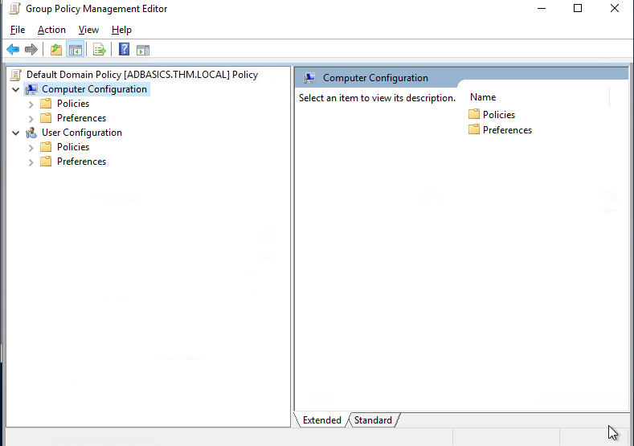

## gpo distribution 

gpos are distributed to the network via a network share calles **SYSVOL** which is stored in DC. 

## Authentication methods 

while using windows domain, all creds are stored in domain controller. whenever a user tried to authenticate to sevice using domain cred, the service will need to ask the domain controller to verify if they are correct. two protocols are used for network authentication in windows domain ; 

- **Kerberos: ** Used by any recent version of windows. THis is the default proctol in any recent domain.
- **NetNTLM:**  Legacy authentication protocl kept for compatibiliy purposes.

## Kerberos Authentication : 

1. **User Login Request**
   - User sends:
     - Username
     - Timestamp (encrypted using password-derived key)
   - Sent to the Key Distribution Center (runs on Domain Controller)

------

1. **Ticket Granting Ticket (TGT) Issued**
   - KDC verifies user
   - Sends back:
     - Ticket Granting Ticket
     - **Session Key**

------

1. **Purpose of TGT**
   - TGT allows user to:
     - Request access to services
     - Without sending password again ✅

------

1. **Encryption Details**
   - TGT is encrypted using:
     - krbtgt account password hash
   - User **cannot read TGT contents**

------

1. **Session Key Usage**
   - Session key is:
     - Shared between user & KDC
     - Used for further requests

------

1. **Important Note**
   - TGT contains a copy of the session key
   - KDC doesn’t store session key separately
   - It can **decrypt TGT to retrieve it when needed**

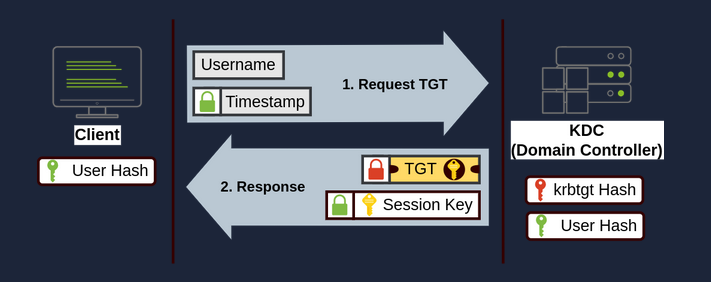

###  Kerberos – Step 2 (Accessing a Service)

1. **Requesting Service Access**
   - User wants to access a service (file share, website, DB)
   - Uses their Ticket Granting Ticket to contact the Key Distribution Center
   - Sends:
     - Username
     - Timestamp (encrypted with Session Key)
     - TGT
     - Service Principal Name (service + server name)

------

1. **Ticket Granting Service (TGS) Response**
   - KDC verifies request
   - Sends back:
     - Ticket Granting Service Ticket
     - **Service Session Key**

------

1. **Encryption Details**
   - TGS is encrypted using:
     - Service owner’s password hash
   - Service owner = account running the service (user/machine)

------

1. **Inside the TGS**
   - Contains:
     - Service Session Key
   - Only the service can decrypt and read it

------

1. **Authenticating to Service**
   - User sends TGS to the target service
   - Service:
     - Decrypts TGS using its password hash
     - Verifies Session Key
   - If valid → access granted ✅

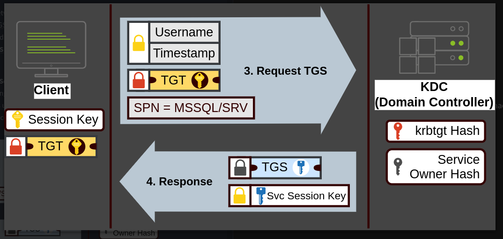

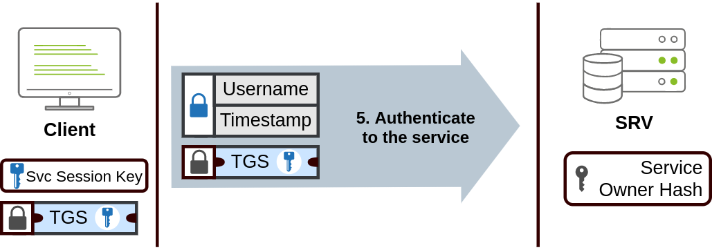

## NetNTLM Authentication

NetNTLM works using a challenge-response mechanism. The entire process is as follows:

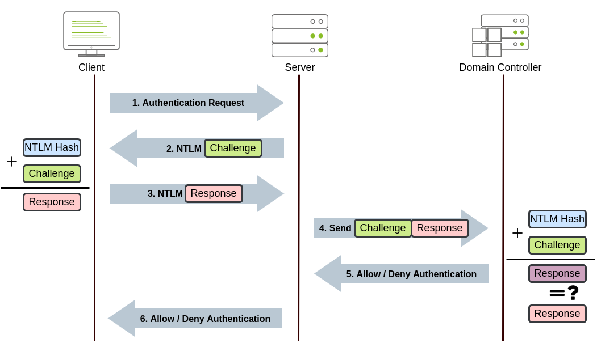

1. The client sends an authentication request to the server they want to access.
2. The server generates a random number and sends it as a challenge to the client.
3. The client combines their 

1.  password hash with the challenge (and other known data) to generate a response to the challenge and sends it back to the server for verification.
2. The server forwards the challenge and the response to the Domain Controller for verification.
3. The domain controller uses the challenge to recalculate the response and compares it to the original response sent by the client. If they  both match, the client is authenticated; otherwise, access is denied.  The authentication result is sent back to the server.
4. The server forwards the authentication result to the client.

Note that the user's password (or hash) is never transmitted through the network for security.

## Trees, Forests and Trusts 

### Tree

- A **tree** = group of domains that share the **same namespace**
- Example:
  - `thm.local` (root domain)
  - `uk.thm.local`
  - `us.thm.local`

### 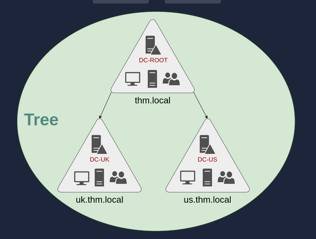

### Forest

- A **forest** = collection of **multiple trees with different namespaces**

### 🧠 Example

- Company merges with another company:
  - `thm.local`
  - `mht.com`

👉 These form a **forest**

### ✅ Key Points

- Different trees
- Different namespaces
- Still connected in one big network

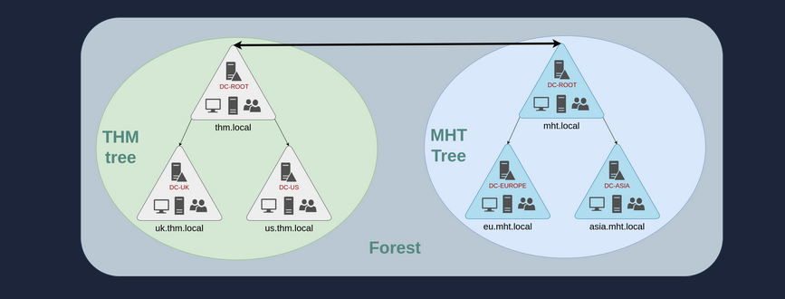

### Trust Relationships

A trueset allows users from one domain to acces rescoures in another domain.

## 🔹 One-Way Trust

- If **Domain AAA trusts Domain BBB**:
  - Users from **BBB can access AAA**
  - But NOT the other way around

⚠️ Important:

- Trust direction ≠ access direction (it’s reversed)

------

## 🔹 Two-Way Trust

- Both domains trust each other
- Users from both sides can access resources

✅ Default in:

- Trees
- Forests
